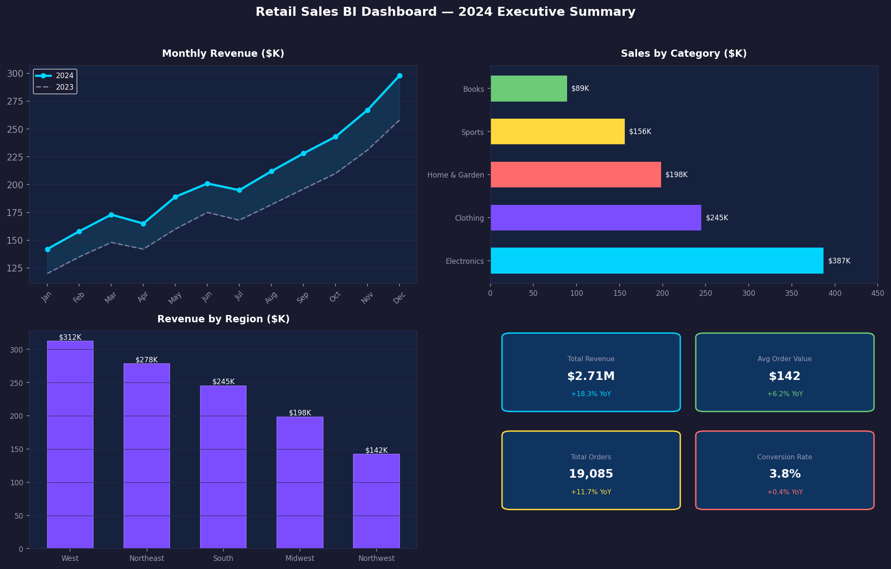

# 📊 Retail Sales BI Dashboard

> End-to-end Business Intelligence pipeline — from raw CSV to interactive Power BI dashboard





---

## 📌 Project Overview

Built a complete BI solution on a **50,000+ row retail sales dataset** — covering data ingestion, transformation, modeling, and interactive visualization in Power BI.

| Metric | Result |
|---|---|
| Dataset size | 50,000+ rows |
| Manual reporting time saved | ~40% |
| Dashboard pages | 5 interactive views |
| ETL automation | Python/Pandas pipeline |

---

## 🔧 Tech Stack

| Layer | Tools |
|---|---|
| Data ingestion & cleaning | Python, Pandas |
| Transformation | Power Query, Pandas |
| Data modeling | Star schema, DAX measures |
| Visualization | Power BI Desktop |
| Version control | Git |

---

## 📁 Project Structure

```
retail-sales-bi-dashboard/
├── data/
│   ├── raw/              # Original CSV dataset
│   └── processed/        # Cleaned output from ETL
├── etl/
│   └── transform.py      # Python ETL script
├── dashboard/
│   └── retail_sales.pbix # Power BI dashboard file
├── notebooks/
│   └── eda.ipynb         # Exploratory data analysis
└── README.md
```

---

## 🚀 Key Features

- **Automated ETL** — Python/Pandas pipeline handles null removal, type casting, date parsing, and feature engineering
- **Star Schema** — Fact table + dimension tables (Product, Region, Date, Customer) for optimized DAX queries
- **5-Page Dashboard**
  - Executive Summary (revenue KPIs, YoY growth)
  - Sales by Region (map visual + bar charts)
  - Product Performance (top/bottom 10, category breakdown)
  - Customer Trends (cohort analysis, repeat purchase rate)
  - Time Intelligence (MTD, QTD, YTD using DAX)
- **Dynamic Filtering** — Slicers for region, product category, and date range across all pages

---

## 📊 Sample DAX Measures

```dax
Total Revenue = SUMX(Sales, Sales[Quantity] * Sales[UnitPrice])

YoY Growth % = 
DIVIDE(
    [Total Revenue] - CALCULATE([Total Revenue], SAMEPERIODLASTYEAR(Date[Date])),
    CALCULATE([Total Revenue], SAMEPERIODLASTYEAR(Date[Date]))
)

Running Total = 
CALCULATE([Total Revenue], FILTER(ALL(Date), Date[Date] <= MAX(Date[Date])))
```

---

## ▶️ How to Run

```bash
# Clone the repo
git clone https://github.com/raashidshaik/retail-sales-bi-dashboard.git
cd retail-sales-bi-dashboard

# Install dependencies
pip install pandas openpyxl

# Run ETL pipeline
python etl/transform.py

# Open dashboard
# Open dashboard/retail_sales.pbix in Power BI Desktop
```

---

## 📬 Contact

**Raashid Shaik** · [LinkedIn](https://linkedin.com/in/raashidshaik45) · [shaikraashid088@gmail.com](mailto:shaikraashid088@gmail.com)
